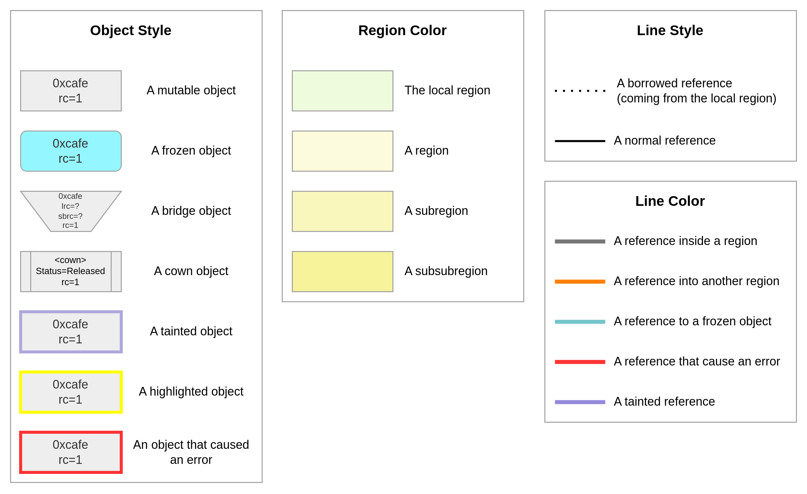

# FrankenScript Dynamic Language experiment

This repository contains a toy programming language called "FrankenScript" with Python-like syntax and Python/JavaScript-inspired semantics.
The purpose of FrankenScript is to explore the design space for adding a region-based ownership system inspired by [Reggio](https://doi.org/10.1145/3622846) and a concurrency
model inspired by [behaviour-oriented concurrency](https://doi.org/10.1145/3622852) to dynamic programming languages to unlock parallelism in a way that is free from data-races
(and also deadlocks, if the full behaviour-oriented concurrency model is adopted). FrankenScript is implemented using [Trieste](https://doi.org/10.1145/3687997.3695647).
To this end, FrankenScript programs generate a file called `mermaid.md` with a Mermaid diagram per line in the source program showing the object and region
graph of the program at that program point. 

This is a legend for the diagrams that FrankenScript generates:



## Pre-requisites

This project is C++20 based and uses CMake as the build system.  We also recommend installing Ninja to speed up the build process.

```base
sudo apt-get install cmake ninja-build clang-15
```

## Build

Once you have the pre-requisites installed, you can build the project by running the following commands:

```bash
mkdir build
cd build
cmake -G Ninja ..
ninja
```

and run the tests with:

```bash
ctest
```

## Run

The project can be run by

```bash
./build/frankenscript build foo.frank
```

where `foo.fs` is a FrankenScript program. This generates a file `mermaid.md` that contains the Mermaid representation of the heap after each step of the program.

You can run in interactive mode by running:

```bash
./build/frankenscript build --interactive foo.frank
```

Which will keep overwritting the `mermaid.md` file with the new heap state after each step.

