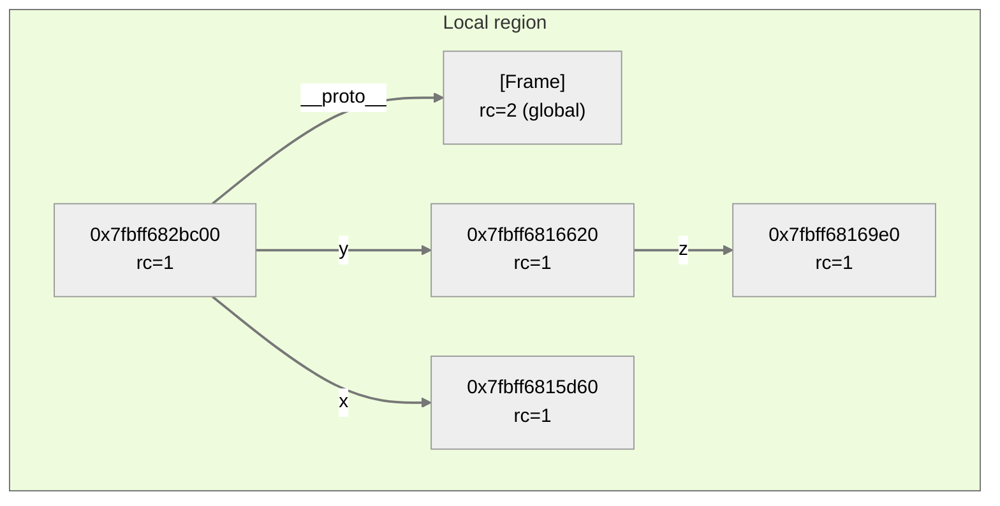

<!--
* Start from section 4
* small introduction
* Mermaid
* legend and color coding
* Draft example code with steps
* Language constructs
* Limitations
-->

<!-- Don't mention paper, make the story clear, from safe to concurrency -->

# FrankenScript

Many dynamic programming languages are single threaded. For the longest time this also included Python. While it allows the creation of threads they run essentially sequential due to the *Global Interpreter Lock (GIL)*. <!-- TODO REF --> However, there is now an increasing effort to remove this restriction to improve performance of multithreaded Python programs.

One important factor with this change is the definition of synchronization mechanisms between the different threads. Previously, it was safe to simply modify the reference count of objects and update values due to the GIL.

FrankenScript explores how *regions* could be used to enforce *ownership* of objects and facilitate safe sharing of these objects between threads. All while trying to maintain backwards compatibility. These concepts and therms will be explained in the following sections with examples.

The output of FrankenScript are several diagrams that show the state of the heap after each instruction. The diagrams can be used to show the evolution of the heap.

This work is inspired by a region-based ownership system called [Reggio](https://doi.org/10.1145/3622846).
FrankenScript is single threaded and doesn't define a concurrency model, but it uses aspects of
[behaviour-oriented concurrency](https://doi.org/10.1145/3622852).

## Explanation by Example

This section will explain problems related to concurrency and how they're addressed by the region-based memory management in FrankenScript. The examples will contain the relevant diagrams for the explanation. All examples can also be executed with FrankenScript to show all intermediate steps. 

### Single Threaded Programs

The simplest kind of program (in the context of concurrency) is a single threaded program. Since there is only one thread there is no need for any synchronization. These programs should remain working with little or no modification to provide backwards compatibility.

FrankenScript uses Python like syntax. Let's consider the following program:

```py
x = {}
y = {}
y.z = {}
```

This constructs three objects. `x` and `y` are variables on the stack. These are modeled as fields of the stack frame. The third object is stored in the `z` field of object `y`. This generates the following diagram:



<!-- TODO: Notice ht local region -->

## Summary

<!-- TODO Fill -->


---

## Context

Before looking at an example, it's worth to introduce the 

<!-- FrankenScript is a monster of our creation. -->
FrankenScript a toy language intended to explore how regions can be used in dynamic programming languages to reason about memory in concurrent programs. The semantics are inspired by Python and JavaScript. The output of FrankenScript are several diagrams that show the evolution of the memory.

This document shows how FrankenScript can be used. It's assumed that the reader has a rough understanding of reference counting, regions, and cowns, as explained in the paper.

Frankenscript has a few more capabilities than described in the paper. This comes from the nature of FrankenScript as a toy language to explore the space. This introduction will focus on the features mentioned in our proposed model in the paper.

The build and run instructions can be found in the main [`README.md`](../README.md) file of the repository.

## Quick Start

Frankenscript uses a Python like syntax. Statements are terminated with new lines and instructions are collected into blocks based on their indention.

<!-- Jump to Legend -->

### A Simple Object

Every object in FrankenScript behaves like a dictionary. Fields can be read and written to, if the current context allows. Let's take a simple example:

```python
obj = {}
obj.f1 = {}
reference = obj.f1
```

The curly brackets `{}` create new empty dictionary. Line 2 populates the field `f1` with a new empty dictionary. The final line creates a reference to the dictionary in the field. The example will generate the following diagram:


<!-- FIXME: Add background differently here, since GH doesn't like this diff -->
<div style='background: #fff'>


</div>

This example only shows the final state of the memory. FrankenScript actually generates one diagram for each step. The `--interactive` flag can be used to step through the program line by line and inspect the memory at the different stages.

### Frozen Objects

### Adding Regions

FrankenScript uses reified regions, meaning that regions are represented as actual objects which are also visible in the generated diagrams. Regions are created by the `Region()` function. They behave like dictionaries and allow assignments to their fields, with the difference that they will also take ownership of the assigned values.

```python
r1 = Region()
r2 = Region()
a = {}

# r1 takes ownership of a
r1.a = a

# r1 takes ownership of r2
r1.r2 = r2
```
<!-- Maybe put the diagram and code side by side? -->

The styling of the arrows indicate what kind of connection the reference is. Borrowed references, i.e. references coming from the local region, are indicated by dotted lines. Connections crossing from one region into another region are highlighted in orange, while region internal connections have a default dark gray color.

Region objects use a trapezoid shape and display the number of incoming borrowed references in the *local reference count (LRC)* and the number of *open subregions (SBRC)*. A region is closed if the `LRC + SBRC` is `0` otherwise it's considered open.


### Arguing With Cowns

Concurrent Owners (Cowns) are special objects in FrankenScript used to enforce ownership and argue about memory safety. While FrankenScript doesn't support concurrency, it allows the simulation of blocking access to cowns and the highlight of the mutable state. This allows reasoning about cowns and the safety of our ownership model.


### Legend

* Colors
* Examples
* Crying

## Advanced Usage

### More Expressions

### Styling the diagram

### Methods

<!--
> P ::= b
> b ::= s | ss
> s ::= while c: b
-->

## Generating Diagrams

FrankenScript

## Built-in functions
